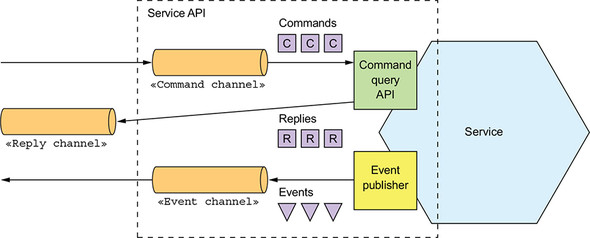

# Tech Talk

## Microservices patterns: call me, message me, maybe I will care!

---

# Overview

* Monoliths
* What are microservices?
* Interprocess Communication
  * Synchronous
  * Asynchronous

---

# Monoliths
## The (initial) good

- **Simple to develop** — IDEs and other developer tools are focused on building a single application.
- **Simple to test** — The developers write end-to-end tests that launch the application, invoke the API, and test the UI (if any).
- **Simple to deploy** — All a developer has to do it to deploy the single artifact.
- **Simple to scale** — Can run multiple instances of the application behind a load balancer.

---

# Monoliths
## The (catching) bad

Successful software grows.

Growth comes with more feature requests, richer features, ever-growing source code.

A big codebase is hard to maintain. Fixing bugs and correctly implementing new
features soon becomes difficult and time consuming.

---

# Monoliths
## The ugly (truth)

Overwhelming complexity tends to be a downward spiral.
If the code base is difficult to understand, a developer won’t make changes correctly.
Each change makes the code base incrementally more complex and harder to understand.

Clean and modular architectural diagrams do not reflect reality.

---

# Monoliths
## Eventually (maybe)

- Development is slow
- Path from commit to deployment is long and arduous
- Scaling is difficult
- Delivering a reliable monolith is challenging
- Locked into increasingly obsolete technology stack

---

---

# The promise of microservices

Microservices, or _the microservice architecture_, is an architectural
style that structures an application as a collection of services that
are:

- Highly maintainable and testable
- Loosely coupled
- Independently deployable
- Organized around business capabilities
- Cloud-friendly

---

# A monolithic e-shop

---

# A microserviced e-shop

---

# The false promise of microservices

**Microservices do not remove complexity, at all.**

They lower complexity in the codebase to increase it in the architecture.

Implementing features, unit testing, upgrading technology are way easier, while integration is way harder.

Distributed systems are hard to reason about and require a broader knowledge from the developers. Code is not enough.

---

# Interprocess Communication

A monolithic service doesn't really need IPC, it's possible to perform internal calls or access
a shared database to have everything needed by the business logic.

**Dependency Injection is enough.**

How can you manage communication between distributed services?

---

# Microservices interaction styles

Being built around single-responsibility principle, communication is always remote.

Communication in distributed systems is two-dimensional:

1. **One-to-one** | **one-to-many** (space)
2. **Synchronous** | **Asynchronous** (time)

---

## One to one
Each client request is processed by exactly one service.

## One to many
Each request is processed by multiple services.

---

## Synchronous
The client expects a timely response from the service and might even block while it waits.

## Asynchronous
The client doesn’t block, and the response, if any, isn’t necessarily sent immediately.

---

| +                 | one-to-one        | one-to-many
| ---               | ---               | ---
| **synchronous**   | Request/response  | －
| **asynchronous**  | Asynchronous request/response; Streaming; One-way notifications | Publish/subscribe; Publish/async responses |

---

# The importance of APIs design

APIs or interfaces are central to software development,
a service’s API is **a contract** between the service and its clients.

An API isn’t defined using a simple programming language construct. By definition, a service and its clients aren’t compiled together.
If a new version of a service is deployed with an incompatible API, there’s no compilation error. Instead, there will be runtime failures.

---

# Request/response: (a)synchronous one-to-one communication
Remote Procedure Invocation

---

## The REST maturity model

> A model (developed by Leonard Richardson) that breaks down the principal elements of a REST approach into three steps. These introduce resources, http verbs, and hypermedia controls.
> http://martinfowler.com/articles/richardsonMaturityModel.html

---

### Level 0
Clients invoke the service by making HTTP POST requests to its sole URL endpoint. Each request specifies the action to perform, the target of the action (for example, the business object), and any parameters.

---

### Level 1
The service supports the idea of resources. To perform an action on a resource, a client makes a POST request that specifies the action to perform and any parameters.

---

### Level 2
The service uses HTTP verbs (GET, POST, PUT, PATCH, ...) to express the semantic of the actions performed on the resource.
The request query parameters and body, if any, specify the actions’ parameters.

---

### Example

---

### Level 3
The service is based on the terribly named HATEOAS (Hypertext As The Engine Of Application State) principle.
The basic idea is that the representation of a resource returned by a GET request contains links for performing actions on that resource.

The benefits of HATEOAS include no longer having to hard-wire URLs into client code.

---

### Benefits of REST

- It’s simple and familiar.
* You can test an HTTP API from within a browser or from the command line.
* It directly supports request/response style communication.
* HTTP is, of course, firewall friendly.
* It doesn’t require an intermediate broker, which simplifies the system’s architecture.

---

### Drawbacks of REST

- It only supports the request/response style of communication.
* Reduced availability. Because the client and service communicate directly without an intermediary to buffer messages, they must both be running for the duration of the exchange.
* Clients must know the locations (URLs) of the service instances(s).
* Fetching multiple resources in a single request is challenging.
* It’s sometimes difficult to map multiple update operations to HTTP verbs.

---

---

# Asynchronous Messaging

- Broken-based
- Broker-less (peer-to-peer messaging)

---

---

---

## One-way message (one-to-one)

The client sends a message, typically a command message, to a point-to-point channel owned by the service.
The service subscribes to the channel and processes the message. It doesn’t send back a reply.

---

## Publish-subscribe (one-to-many)

Messaging is the ideal solution for this type of communication, it's built in the pattern.

A client publishes a message to a publish-subscribe channel that is read by multiple consumers.

The consumers may or may not interpret the message depending on their domain rules and can publish messages in turn.

---

## Example: CQRS

